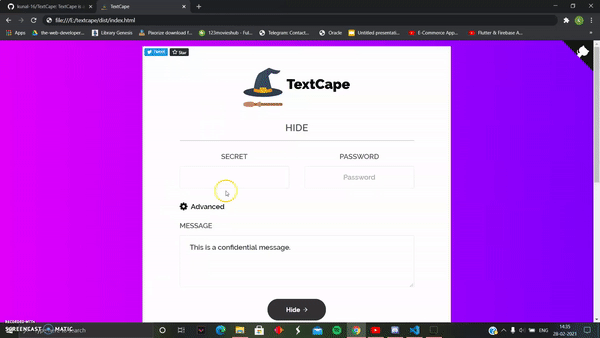
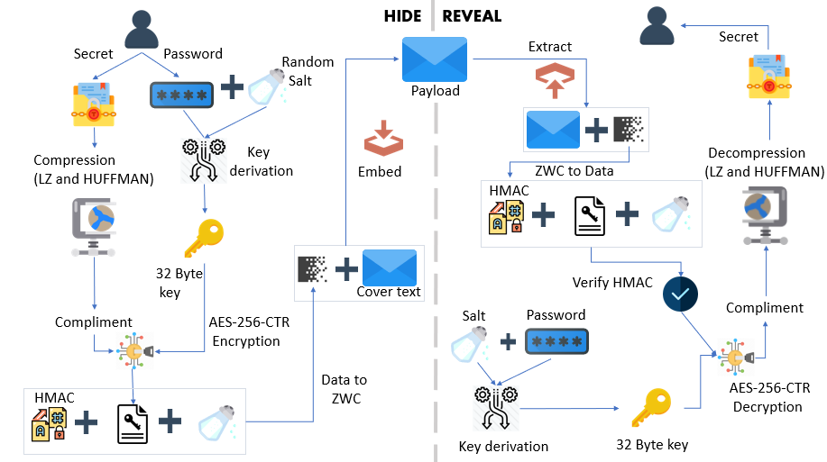

<h1 align="center">
   
  
   
   
  TextCape
   
  
  
   
  
   
</h1>
<h4 align="center">The Cloak of Invisibility for your texts</h4>

StegCloak is a pure JavaScript steganography module designed in functional programming style, to hide secrets inside text by compressing and encrypting the secret before cloaking it with special unicode invisible characters. It can be used to safely watermark strings, invisible scripts on webpages, texts on social media or for any other covert communication. Completely invisible! See how it works in-depth in this Medium <a href="https://blog.bitsrc.io/how-to-hide-secrets-in-strings-modern-text-hiding-in-javascript-613a9faa5787">article</a> or watch our <a href="https://www.youtube.com/watch?v=RBDqZwcGvQk">demo</a> to know what it does.

## Features
- Protect your invisible secret using passwords and HMAC integrity
- Cryptographically secure by encrypting the invisible secret using AES-256-CTR.
- Uses 6 Invisible characters in unicode characters that works everywhere in the web - Tweets, Gmail, WhatsApp, Telegram, Instagram, Facebook, and many more!
- Maximum Compression to reduce the payload (LZ, Huffman).
- Completely invisible, uses Zero Width Characters instead of white spaces or tabs.
- Super fast! Hides the Wikipedia page-source for steganography (800 lines and 205362 characters) within a covertext of 3 words in under one second.
- Hiding files in strings can be achieved by uploading the file to cloud and stegcloaking the link in the string
- Written in pure functional style.
- Usage - Available as an API module, a CLI and also a <a href='https://stegcloak.surge.sh'>Web Interface</a> (optimized with web workers). 

 

## How it works

